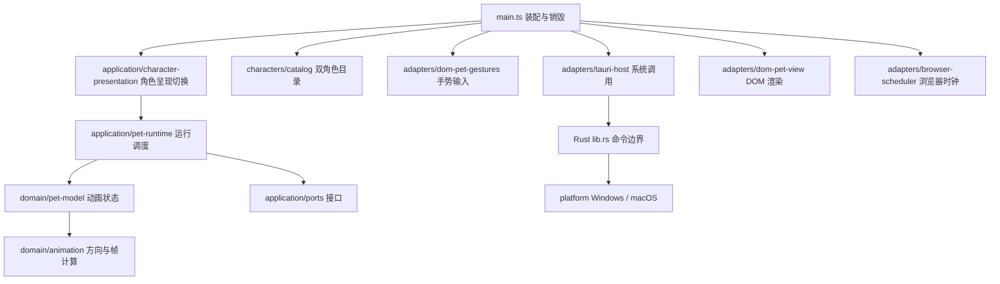

# 架构与开发说明

G7-A 新增只读构建身份：`build_identity_support.rs` 在构建时捕获限定输入范围的 Git 来源并观察增量输入；`build_info.rs` 的一个常量供预 GUI `--build-info` 与 `get_build_info` IPC 使用。现有设置页的折叠版本区域独立读取，不加入提醒业务控制器或持久化；打包器核对实际二进制后才写 manifest。输入范围、契约和验收边界见 [G7-BUILD-IDENTITY.md](G7-BUILD-IDENTITY.md)。

G7-B1/B2 建立两层原生数据边界：`data_lock.rs` 持有排他文件锁；`data_directory.rs` 在持锁后验证活动数据集和待导入记录，再让 `lib.rs` 建立唯一 Tauri context 与业务服务。重复的协议内实例在业务 setup 前退出，不创建第二托盘或写入者。锁只协调采用同一约定的实例，不能约束旧版或任意外部工具。各 Store 自行验证 schema、原子保存和失败状态；目录、指针不可信时不给可写路径。G7 原始三文件协议见 [数据目录](G7-DATA-DIRECTORY.md) 和 [整体切换](G7-DATA-TRANSFER-CORE.md)；当前 M5 候选会先完成旧 v1 待导入，再把旧平铺/活动数据集迁移为包含专注状态的四文件 v2，单一活动指针仍是提交点，详见 [M5 数据集说明](M5-DATASET-V2.md)。以上自动验证不等于双平台 GUI 或断电验收。

本文描述本次重构后的实际代码边界，并单独标出未来设计。产品选择见 [长期计划](PRODUCT-PLAN.md)，执行范围见 [本次执行计划](IMPLEMENTATION-ARCHITECTURE.md)。

2026-09-23 集成候选：当前 Rust 已实现鼠标采样、G1/G2 唯一原生托盘与位置控制、G4 双角色选择、G5/G6 提醒引擎和原生气泡，并接入 G7 本地备份导出及下次启动导入。主线 PR #12 的 macOS“切换到当前桌面”已接入 `desktop/`：同一托盘发起隐藏，单工作线程计时，回到主线程后仅当前可见意图可走既有显示/位置恢复路径。后续隐藏、显示、重置、退出或窗口销毁使旧代次失效。自动验证与本候选实机验收分开记录，不能把历史 v0.2.0/PR #12 的结果视为本提交通过。

实际测试结果和未验证项见 [架构验证记录](ARCHITECTURE-VALIDATION.md)。

## 为什么这样拆

原 `src/main.ts` 同时保存动画状态、轮询系统坐标、处理鼠标输入和写 DOM。继续把提醒计时、角色台词、托盘状态放进去，会让一个功能的时序修改影响所有功能。

现在保留小型 TypeScript + Tauri 项目，不引入 UI 框架、依赖注入容器、全局事件总线或插件系统。以明确函数和小接口隔离会变化的边界，所有模块都由真实运行入口使用。



## 当前目录与职责

| 路径（相对 `march-7th-app/src`） | 可以做 | 不可以做 |
|---|---|---|
| `main.ts` | 选定配置、构造适配器、启动、注册清理 | 保存业务状态、写动画规则 |
| `entries/settings.ts`、`entries/reminder.ts` | 各自装配真实页面与生命周期 | URL 总路由、业务计时、原生窗口策略 |
| `domain/reminder.ts` | Rust 提醒 DTO、固定 ID 与草稿复制 | 到期计算、业务状态迁移、IO |
| `application/reminder-settings.ts`、`reminder-presentation.ts` | 草稿和保存反馈、稳定条目呈现、窄宿主端口 | 提醒计时、配置文件写入、乐观完成 |
| `adapters/tauri-reminders.ts`、`reminder-dto.ts` | IPC 校验、revision 围栏、回应去重、ready 接口 | 复制 Rust 业务规则 |
| `adapters/dom-reminder-*.ts` | 原生表单、文本、稳定按钮节点 | 持久化、自动启用或提交 |
| `domain/animation.ts` | 纯坐标和图集帧计算、公共值类型 | DOM、Tauri、计时器、文件读写 |
| `domain/character.ts` | 当前动画所需的角色契约 | 依赖某个角色 ID 或 UI |
| `domain/pet-model.ts` | 接收采样和时间，输出动画帧 | 自行获取时间、异步 IO、调用原生窗口 |
| `characters/catalog.json`、`catalog.ts` | 双角色编译期数据与完整校验 | 外部角色导入、提醒规则、系统调用 |
| `application/ports.ts` | 窄接口：系统采样、视图、调度器 | 具体 Tauri/DOM 实现 |
| `application/pet-runtime.ts` | 采样、渲染、情境回应、输入连接、资源释放 | 直接访问 DOM/Tauri，全局共享业务状态 |
| `application/character-presentation.ts` | revision 快照、图集预载、失败保旧和运行实例切换 | 持久化选择、伪造原生成功状态 |
| `adapters/tauri-host.ts` | `invoke` 与原生拖动、IPC 数据校验 | 动画优先级和提醒节奏 |
| `adapters/dom-pet-view.ts` | 配置驱动的 CSS 图集、短句/错误呈现、去重绘制 | 判断提醒是否完成、读取系统坐标 |
| `adapters/dom-pet-gestures.ts` | pointer capture、单双击和拖动手势翻译 | 动画优先级、角色选择持久化 |
| `adapters/browser-scheduler.ts` | 单调时钟、RAF、定时器 | 业务决策 |

`scripts/check-architecture.mjs` 使用 TypeScript AST 检查 import/export/dynamic import、循环依赖和内层禁止的宿主全局访问；`pnpm check:architecture` 在 CI 执行。它是结构护栏，不替代代码审查。

## 当前运行协议

- **坐标**：Rust 返回窗口内逻辑坐标 `x/y` 和窗口全局逻辑坐标 `windowX/windowY`。Windows/macOS 的换算差异只留在 Rust `platform/` 中，前端不按 OS 分支。
- **时间**：动画使用注入的单调时间（生产环境 `performance.now()`），不依赖系统日期。测试能精确检查 90/160/280 ms 边界。
- **状态**：每个 `PetModel` 实例独占帧、方向、上次窗口位置和移动截止时间，没有模块级可变单例。
- **优先级**：移动 > 单次动作 > 注视 > 待机。移动超过 0.5 逻辑像素即中止互动并延长屏蔽至 160 ms 后；纯竖直移动沿用上次水平方向；角色中心 20 px 内待机。
- **轮询**：等待上一次采样完成，再等 33 ms；不会累计重叠 IPC。故障时本轮标为 unavailable、清空注视，后续继续采样。
- **失败**：拖动 Promise 的拒绝会被捕获并输出可诊断错误；它的结束不是“拖动结束”的权威信号。移动结束继续以窗口位移判断。
- **生命周期**：一次启动返回含 `stop()` 与 `respond()` 的窄控制器；停止幂等，移除输入监听并取消 RAF/定时器。停止后才返回的 IPC 结果不得更新 UI 或创建新轮询。页面退出与 Vite HMR 都调用清理。
- **渲染**：只有图集帧变化才修改位置。图集、单元格尺寸、帧数由同一个角色定义提供，不再分散在 CSS 和主程序。

当前已有三月七与雷电将军两个内置角色，角色定义来自同一个编译期 JSON 目录；不是外部导入协议，也不是 Codex 的 `pet.json` 格式。封存包及其图集不修改。前端安全切换控制器已接入 Rust 真实快照；启动先注册监听，再读取快照，以 revision 排除迟到旧值，不先显示伪造的默认选择。

## 原生桌面状态（G2 已实现，实机待验收）

Rust `desktop/` 负责托盘、交互/穿透模式和位置；`coordinates.rs` 统一 macOS 源/目标缩放边界并保留 Windows 全局物理坐标，`geometry.rs` 做单个目标工作区内的纯坐标计算，`state.rs` 管理生命周期及500 ms单待保存值，`store.rs` 是版本化配置的唯一写入者，`mod.rs` 连接原生效果与单个后台工作线程。配置只保存工作区相对逻辑位置；模式/隐藏状态不持久化。正常退出先异步保存，UI 不等待后台；2秒原生拓扑检查与DPI回调负责恢复可达性。所有原生调用均在释放状态锁后执行。

配置损坏或未来版本当次运行只读；保存通过同目录临时文件、有效旧配置备份与原子替换，失败不报告成功。前端不读取或写入配置，也不承担桌面恢复定时器。详见 [G2-PLACEMENT.md](G2-PLACEMENT.md)。G1 已有双平台自动证据；本轮 G2 的本地 Windows 自动检查不能替代当前提交的双平台 CI、独立审查和 GUI 验收。

## 后续模块设计与待接入边界

### 角色切换与互动（已实现，实机与所有者验收待完成）

`characters/` 已包含两份资源定义和内置目录；新增动作/台词契约时仍需同步更新模型和验证。视图重设图集时清空帧缓存。应用层先解码并核对图集尺寸，成功后停止旧宠物运行实例并建立新实例；提醒服务不随宠物实例销毁。Rust `characters/` 从同一编译期 catalog.json 读取 ID、显示名与默认项；托盘和 IPC 共用单个选择服务，未知命令 ID 拒绝。角色选择不操作窗口位置、显示、隐藏、穿透或提醒状态。

单击/双击识别放在独立 DOM 输入适配器，动画状态机只接收明确动作事件。拖动优先于点击互动，互动结束回到注视或待机。用户意图和动画状态分开，不能靠 CSS 动画结束来认定提醒完成。提醒完成/稍后的短句入口只是有类型的呈现能力，没有创建提醒或更改提醒状态。

### 提醒状态归属（G5 后端与 G6 原生呈现已实现，实机待验收）

`src-tauri/src/reminders/model.rs` 独占 settings、三项 progress、pause、quiet、snoozePending 与会话 presentation，只消费显式命令及 UTC/本地分钟/单调时间样本。pending 和软件展示处理标记分别保存；到期不累计周期，手动查看不完成事项。单项启用/间隔实际变化只重置该项，稍后覆盖新到期，手动视图处理普通自动意图，期满前保留明确稍后意图；期满且允许展示后就在同一手动视图消费，不因关闭再自动重弹。

`store.rs` 校验 `reminders.json` v1 的固定 ID、范围及交叉状态，复用共享 atomic_file::replace，保存前验证旧内容。`service.rs` 一条专属线程独占规则和 IO，短锁只交换快照/队列；无变化不逐秒保存/发事件，写失败保留已应用状态并明确 unsaved。损坏/未来配置保护原件并禁自动提醒，配置不能绕过只读保护。v1 为首个格式，真实升级迁移和导出导入留 G7。

`native.rs` 以 chrono Local/进程 Instant 注入时间，提供 get_reminders 和固定联合 reminder_command，发送 reminders-changed 与一次性 reminder-response。main 仅订阅一次回应事件并路由至当前角色呈现控制器；未初始化、已销毁时不排队，get/快照/命令回复不触发角色动作。lib 显式组合角色、提醒服务/界面、desktop setup 与退出，仍只有一个 app_context。退出不在 UI join，取消未执行队列；已开始写允许完成但不发布迟到状态/事件。此前前端 reminder-service 计时设想已替代，不能再建第二个业务计时器。

初始三项全关。Vite 现在实际构建 `settings.html` 与 `reminder.html`；设置使用独立草稿，回复和最新快照都确认匹配且无 runtimeError 才报告保存成功；unsaved 明确区分本次已应用与未落盘。后台更新不覆盖未提交字段。提醒仅呈现当前 presentation，完成行留在本批次原位置，新条目追加，新 ID 重建。原生按需窗口、托盘、最小事件权限与 ready 命令已接通；autoHandled、ready 或窗口 show 成功都不证明真人看到。接入接口与待验收边界见 [G6-REMINDERS.md](G6-REMINDERS.md)，规则以 [REMINDER-SPEC.md](REMINDER-SPEC.md) 为准。本地自动测试与后续双平台 CI/GUI/真实反馈分开记录。

### UI 与桌面能力

气泡只显示状态并发送 `complete(id)`、`snoozeAll`、`dismiss(presentationId)` 等明确事件；`dismiss` 仅改变展示状态。文字只用文本渲染，不把角色短句当 HTML。

托盘、点击穿透、位置恢复由 Rust 桌面能力管理。提醒采用独立可交互气泡窗口，不抢焦点，角色窗口继续保持用户选择的穿透模式。气泡关闭只改变展示，未回应不反复弹出；从固定入口可再次查看待处理事项。M3 必须验证穿透下按钮可操作，不允许把按钮画在永远收不到鼠标的窗口里。

当前 M5 技术候选仍通过活动时段、手动暂停和全局稍后实现安静策略，不自动检测其他应用。`focus/model.rs` 只描述一场会话；Rust focus worker 独占状态与 `focus.json`，先原子保存成功再发布快照和精确导出字节。健康运行按剩余时间与 60 秒上限做检查点，失败后台重试有退避；设置页每秒视觉插值不调用写盘命令，也不自行宣布完成。`focus.json` 内层 v2 只增加一个当前任务，旧 v1 严格迁移；外层四文件数据集和本地备份独立版本化。提醒与专注共用一套气泡呈现协调器：专注运行时日常提醒仍 pending 但不主动弹，实时自然完成只有一次展示机会；手动待处理视图优先，角色动作/短句仅回应实际操作或一次完成，不发展成任务管理器或第二通知队列。见 [M5 技术候选](M5-TECHNICAL-CANDIDATE.md)。

### 角色与扩展边界

M2 与 M3 在 M1 之后并行。三月七与雷电将军已作为两个内置角色接入前端目录；角色样例与最终外观、动作、短句仍由所有者验收。记录来源、版本、使用范围及能力；只制作应用使用的动作，不为新角色强制补齐旧 Codex 的全部动画行。

角色定义包含已使用的待机、左右移动、wave/jump 单次动作，以及点击、提醒、专注完成和当前任务结果等实际情境短句；不引入外部脚本、插件市场或公共 SDK。新增情境与测试一同交付，台词口吻仍由所有者最终验收。

## 如何增加功能而不破坏边界

1. 先读 PRODUCT-PLAN 与 TODO，确认当前阶段；写清触发、优先级、退出和失败行为。
2. 纯规则先加状态/边界测试，使用显式时间和输入；不靠真实等待。
3. 只有涉及 IO 时才扩充窄接口，不给接口塞完整 Tauri/DOM 对象。
4. 由应用层连接规则与适配器，入口只负责装配；避免新增泛化 `utils.ts` 或全局可变 store。
5. 跑 `pnpm check`；涉及 Rust 时跑 fmt/test/Clippy。更新文档的“已实现/待实施”边界。
6. 共享行为在 Windows/Mac 用同一清单验收；截图/实测与自动测试分开记录。没有完成两边测试时保留未验收状态。

不按文件行数机械拆文件；当一个模块同时拥有两个独立变化原因或数据写入者时再拆。新依赖必须解决具体问题，不能只为未来可能需要而引入框架。

## 本地验证

```sh
cd march-7th-app
pnpm install --frozen-lockfile
pnpm check
cargo fmt --manifest-path src-tauri/Cargo.toml --check
cargo test --locked --manifest-path src-tauri/Cargo.toml
cargo clippy --locked --manifest-path src-tauri/Cargo.toml --all-targets -- -D warnings
pnpm tauri dev
```

测试层次：入口行为回归检验旧体验；模型测试检验状态与时间边界；运行器测试检验异步和资源释放；适配器测试检验 IPC 数据与图集呈现；结构检查防止反向依赖。它们不能证明透明窗口、系统拖动和混合 DPI 的真实效果。


### 原生角色保存与退出边界

`character-preferences.json` v1 只保存 `version` 与 `selectedCharacterId`，由 Rust 唯一写入。`atomic_file.rs` 只共享同目录临时写、备份和替换；desktop/store 和 characters/store 各自保留 schema 校验，未引入通用 repository。正常选择在专属单个串行 IO 工作线程保存成功后才提交有效 ID 与递增 revision；失败保留旧 ID，托盘禁用状态项显示保存失败。菜单勾选和事件在主线程从最新快照更新，状态锁不覆盖 IO 或原生调用。原 desktop 工作线程、位置恢复与退出末次保存协议保持独立。

无配置使用 catalog.defaultId，状态为“默认（尚未保存）”。有效 v1 中未知 ID 回退默认并显示“未知记录，使用默认（未覆盖）”，显式再次选择默认可以规范化文件。损坏、未来版本或启动读取失败时本次只读，仍可换角但显示“角色：仅本次有效”；读取与写入错误只报告固定诊断，不输出原始配置。运行中发现外部替换为非法 schema 也转为会话选择。

首次退出请求立即停止接收角色请求，排队但未执行的选择不再保存；退出时尚未提交的原子写允许完成，但不再提交选择、回复成功或更新托盘/前端；退出前已提交的回复可能稍后送达，前端销毁保护继续丢弃迟到输入，也不拖住 desktop 退出线程。若进程先结束，磁盘保持替换前或替换后的完整版本；这不是“退出前所有点击都保存”的保证。测试覆盖阻塞 IO 时快照仍可读取、退出可推进、队列取消与迟到提交抑制。

前端验证 `selectedCharacterId/revision/persistence`，映射到呈现控制器的 `characterId`，忽略旧 revision。图集读取失败保留旧实例，短错误显示 4 秒并保留诊断日志，不伪造 Rust 回退；在托盘再次选择相同角色产生新 revision，可重新尝试加载。监听及首次读取迟到时均尊重 dispose。此自动检查边界不等同 Windows/macOS 实机验收。

### G6 原生提醒协调

`reminders/ui.rs` 只负责两个具体窗口与托盘菜单，`ui_policy.rs` 管理展示/建窗/退出围栏，`ui_geometry.rs` 根据真实外框和工作区计算位置/可缩小视口。model/store/service 不持有 Tauri 窗口。desktop 只有限开放已验证的 macOS 目标屏坐标换算和 Monitor 构造，未引入通用窗口框架。

首次全关不创建两页 WebView；配置中的 settings/reminder 为 create=false、visible=false、focus=false。Windows 的锁定 Tauri API 禁止在同步事件回调建 WebView，因此后台异步创建隐藏窗口，完成后回主线程协调。每次实际提醒窗口创建分配安全整数 windowToken 并注入页面；ready 同时校验调用窗口、当前 token、presentationId 和停止状态，提前于建窗完成的有效 ready 可保留。连续两次实际几何观测一致且当前页面 ready 后才 show。新 ID、销毁、重载和退出废弃旧定位/显示资格；迟到隐藏建窗使用 destroy 清理，不走正常的关闭转隐藏路径。

服务通知在释放服务锁后排到主线程；协调器读取最新 Snapshot，避免旧通知重开已收起视图。回应事件保留原动作 revision，只发一次。100 ms 有界排队观察仅检查原生几何/显示状态，不计算到期或另发提醒；连续失败停止该次展示并保留业务 pending，托盘可显式重新查看。已显示的同 ID 不反复 show 或跟随角色跳动，工作区变化不可达时重新约束。

main/reminder 显式 acceptFirstMouse=true，reminder 始终 focusable=false、鼠标接收独立于角色穿透；只有用户从托盘打开设置才调用 set_focus。设置页面使用限定 settings 调用方的 hide_reminder_settings，先取消待执行显示再隐藏；不授予任意窗口 hide、文件或系统执行权限。手动打开设置发送 reminder-settings-opened，首次页面仍自行读取真实快照。原生关闭气泡只提交当前 presentation 的 Dismiss，不完成业务项。

此为实现和策略测试边界。真实 Mac 非活动首次点击/拖动、不抢焦点、Windows 原生按钮、透明、混合 DPI、睡眠/重启和长期资源表现必须单独验收。
