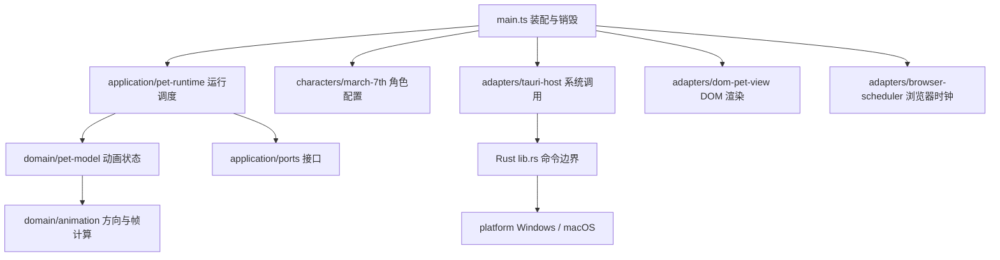

# 架构与开发说明

本文描述本次重构后的实际代码边界，并单独标出未来设计。产品选择见 [长期计划](PRODUCT-PLAN.md)，执行范围见 [本次执行计划](IMPLEMENTATION-ARCHITECTURE.md)。

2026-09-22 更新：长期计划已确定提醒引擎、桌面控制和持久化由 Rust 负责。该决定仅更新下面的目标架构，当前 Rust 实现仍只提供鼠标采样能力；提醒、托盘与存储尚未实现。

实际测试结果和未验证项见 [架构验证记录](ARCHITECTURE-VALIDATION.md)。

## 为什么这样拆

原 `src/main.ts` 同时保存动画状态、轮询系统坐标、处理鼠标输入和写 DOM。继续把提醒计时、角色台词、托盘状态放进去，会让一个功能的时序修改影响所有功能。

现在保留小型 TypeScript + Tauri 项目，不引入 UI 框架、依赖注入容器、全局事件总线或插件系统。以明确函数和小接口隔离会变化的边界，所有模块都由真实运行入口使用。



## 当前目录与职责

| 路径（相对 `march-7th-app/src`） | 可以做 | 不可以做 |
|---|---|---|
| `main.ts` | 选定配置、构造适配器、启动、注册清理 | 保存业务状态、写动画规则 |
| `domain/animation.ts` | 纯坐标和图集帧计算、公共值类型 | DOM、Tauri、计时器、文件读写 |
| `domain/character.ts` | 当前动画所需的角色契约 | 依赖某个角色 ID 或 UI |
| `domain/pet-model.ts` | 接收采样和时间，输出动画帧 | 自行获取时间、异步 IO、调用原生窗口 |
| `characters/march-7th.ts` | 图集尺寸、动作行/帧数/间隔 | 提醒规则、系统调用 |
| `application/ports.ts` | 窄接口：系统采样、视图、调度器 | 具体 Tauri/DOM 实现 |
| `application/pet-runtime.ts` | 采样、渲染、输入连接、资源释放 | 直接访问 DOM/Tauri，全局共享业务状态 |
| `adapters/tauri-host.ts` | `invoke` 与原生拖动、IPC 数据校验 | 动画优先级和提醒节奏 |
| `adapters/dom-pet-view.ts` | 配置驱动的 CSS 图集、输入监听、去重绘制 | 判断提醒是否完成、读取系统坐标 |
| `adapters/browser-scheduler.ts` | 单调时钟、RAF、定时器 | 业务决策 |

`scripts/check-architecture.mjs` 使用 TypeScript AST 检查 import/export/dynamic import、循环依赖和内层禁止的宿主全局访问；`pnpm check:architecture` 在 CI 执行。它是结构护栏，不替代代码审查。

## 当前运行协议

- **坐标**：Rust 返回窗口内逻辑坐标 `x/y` 和窗口全局逻辑坐标 `windowX/windowY`。Windows/macOS 的换算差异只留在 Rust `platform/` 中，前端不按 OS 分支。
- **时间**：动画使用注入的单调时间（生产环境 `performance.now()`），不依赖系统日期。测试能精确检查 90/160/280 ms 边界。
- **状态**：每个 `PetModel` 实例独占帧、方向、上次窗口位置和移动截止时间，没有模块级可变单例。
- **优先级**：移动 > 注视 > 待机。移动超过 0.5 逻辑像素即延长屏蔽至 160 ms 后；纯竖直移动沿用上次水平方向；角色中心 20 px 内待机。
- **轮询**：等待上一次采样完成，再等 33 ms；不会累计重叠 IPC。故障时本轮标为 unavailable、清空注视，后续继续采样。
- **失败**：拖动 Promise 的拒绝会被捕获并输出可诊断错误；它的结束不是“拖动结束”的权威信号。移动结束继续以窗口位移判断。
- **生命周期**：一次启动返回 `stop()`；调用幂等，移除输入监听并取消 RAF/定时器。停止后才返回的 IPC 结果不得更新 UI 或创建新轮询。页面退出与 Vite HMR 都调用清理。
- **渲染**：只有图集帧变化才修改位置。图集、单元格尺寸、帧数由同一个角色定义提供，不再分散在 CSS 和主程序。

本次仍只有三月七一个真实角色。角色定义是应用内部编译期数据；不是外部导入协议，也不是 Codex 的 `pet.json` 格式。封存包及其图集不修改。

## 原生桌面状态（G2 已实现，实机待验收）

Rust `desktop/` 负责托盘、交互/穿透模式和位置；`geometry.rs` 做纯坐标计算，`state.rs` 管理生命周期及500 ms单待保存值，`store.rs` 是版本化配置的唯一写入者，`mod.rs` 连接原生效果与单个后台工作线程。配置只保存工作区相对逻辑位置；模式/隐藏状态不持久化。正常退出先异步保存，UI 不等待后台；2秒原生拓扑检查与DPI回调负责恢复可达性。所有原生调用均在释放状态锁后执行。

配置损坏或未来版本当次运行只读；保存通过同目录临时文件、有效旧配置备份与原子替换，失败不报告成功。前端不读取或写入配置，也不承担桌面恢复定时器。详见 [G2-PLACEMENT.md](G2-PLACEMENT.md)。G1 已有双平台自动证据；本轮 G2 的本地 Windows 自动检查不能替代当前提交的双平台 CI、独立审查和 GUI 验收。

## 后续模块设计（尚未实现）

### 角色切换与互动

M2 在 `characters/` 增加第二份资源定义和内置目录；新增动作/台词契约时同步更新模型和验证。视图重设图集时必须清空帧缓存。应用层负责停止旧宠物运行实例、建立新实例；提醒服务不随宠物实例销毁。

单击/双击识别放在输入/应用层，动画状态机只接收明确动作事件。拖动优先于点击互动，互动结束回到注视或待机。用户意图和动画状态分开，不能靠 CSS 动画结束来认定提醒完成。

### 提醒状态归属

G5 在 Rust 中实现独立提醒领域规则和运行调度，使用注入时间验证到期、完成、稍后、暂停与恢复。前端只读取状态快照、发送有类型的命令并表现角色反馈。此前由前端 `application/reminder-service.ts` 管理计时的设想已被替代；不要建立前后端双重状态权威，也不要把提醒进度塞入 `PetModel` 或角色文件。

建议的持久化模型：

| 层级 | 数据 | 规则 |
|---|---|---|
| 每个提醒 | 稳定 ID、enabled、intervalMs、nextDueAt、pending、lastCompletedAt | 完成只更新对应项 |
| 应用级 | quietUntil、schemaVersion | 稍后是全局安静期，与角色无关 |
| 角色选择 | selectedCharacterId | 只决定表现，未知 ID 回退默认角色 |
| 临时 UI | 正在展示的事项、气泡倒计时 | 收起不清除 pending，不认定完成 |

表中是待实施契约，不是当前已存在的存储格式。首次确认设置再启用；隐藏不隐式暂停；未回应保持待处理且提供固定查看入口。活动时段外不主动提示，恢复时合并处理。修改间隔、禁用后重新启用、重启及时间跳变的具体交互规格在 G5/G6 固定并测试，不临时交给 UI 猜测。

提醒跨重启用墙上时钟截止时间，动画用单调时钟；两者不得混用。睡眠恢复只评估当前到期集合，不重播每个错过的周期。系统时间跳变需单独测试和明确补偿策略。

Rust 是持久化的唯一写入者。托盘、设置和前端都向同一应用服务提交命令，不能各自读改写一份 JSON。配置带版本，迁移前备份，写入失败必须显式报告；本地迁移提供导出导入，不依赖账号。隐藏 UI 时仍维持原生调度，不能把 RAF 当提醒时钟。操作系统睡眠及恢复仍需实机测试，不能以“放在 Rust”代替验证。

### UI 与桌面能力

气泡只显示状态并发送 `complete(id)`、`snoozeAll(duration)`、`dismiss()` 等明确事件；`dismiss` 仅改变展示状态。文字只用文本渲染，不把角色短句当 HTML。

托盘、点击穿透、位置恢复由 Rust 桌面能力管理。提醒采用独立可交互气泡窗口，不抢焦点，角色窗口继续保持用户选择的穿透模式。气泡关闭只改变展示，未回应不反复弹出；从固定入口可再次查看待处理事项。M3 必须验证穿透下按钮可操作，不允许把按钮画在永远收不到鼠标的窗口里。

初期通过活动时段、手动暂停和全局稍后实现安静策略，不自动检测其他应用。未来专注功能只围绕单会话，任务陪伴只增加当前一个任务名称；它们共用提醒的展示协调规则，不能另建一套相互打断的通知机制。

### 角色与扩展边界

M2 与 M3 在 M1 之后并行。可用三月七原型验证提醒，正式首个日用版本仍需两角色。角色由所有者选定参考，AI 辅助制作，样例与最终外观、动作、短句由所有者验收。记录来源、版本、使用范围及能力；只制作应用使用的动作，不为新角色强制补齐旧 Codex 的全部动画行。第二角色尚未选定，不能由执行者自行决定。

未来角色定义只增加动作能力和情境短句映射；不引入外部脚本、插件市场或公共 SDK。当前角色类型仍只声明已用到的待机和左右移动，增加契约应与实际功能及测试同时交付。

## 如何增加功能而不破坏边界

1. 先读 PRODUCT-PLAN 与 TODO，确认当前阶段；写清触发、优先级、退出和失败行为。
2. 纯规则先加状态/边界测试，使用显式时间和输入；不靠真实等待。
3. 只有涉及 IO 时才扩充窄接口，不给接口塞完整 Tauri/DOM 对象。
4. 由应用层连接规则与适配器，入口只负责装配；避免新增泛化 `utils.ts` 或全局可变 store。
5. 跑 `pnpm check`；涉及 Rust 时跑 fmt/test/Clippy。更新文档的“已实现/待实施”边界。
6. 共享行为在 Windows/Mac 用同一清单验收；截图/实测与自动测试分开记录。没有完成两边测试时保留未验收状态。

不按文件行数机械拆文件；当一个模块同时拥有两个独立变化原因或数据写入者时再拆。新依赖必须解决具体问题，不能只为未来可能需要而引入框架。

## 本地验证

```sh
cd march-7th-app
pnpm install --frozen-lockfile
pnpm check
cargo fmt --manifest-path src-tauri/Cargo.toml --check
cargo test --locked --manifest-path src-tauri/Cargo.toml
cargo clippy --locked --manifest-path src-tauri/Cargo.toml --all-targets -- -D warnings
pnpm tauri dev
```

测试层次：入口行为回归检验旧体验；模型测试检验状态与时间边界；运行器测试检验异步和资源释放；适配器测试检验 IPC 数据与图集呈现；结构检查防止反向依赖。它们不能证明透明窗口、系统拖动和混合 DPI 的真实效果。
