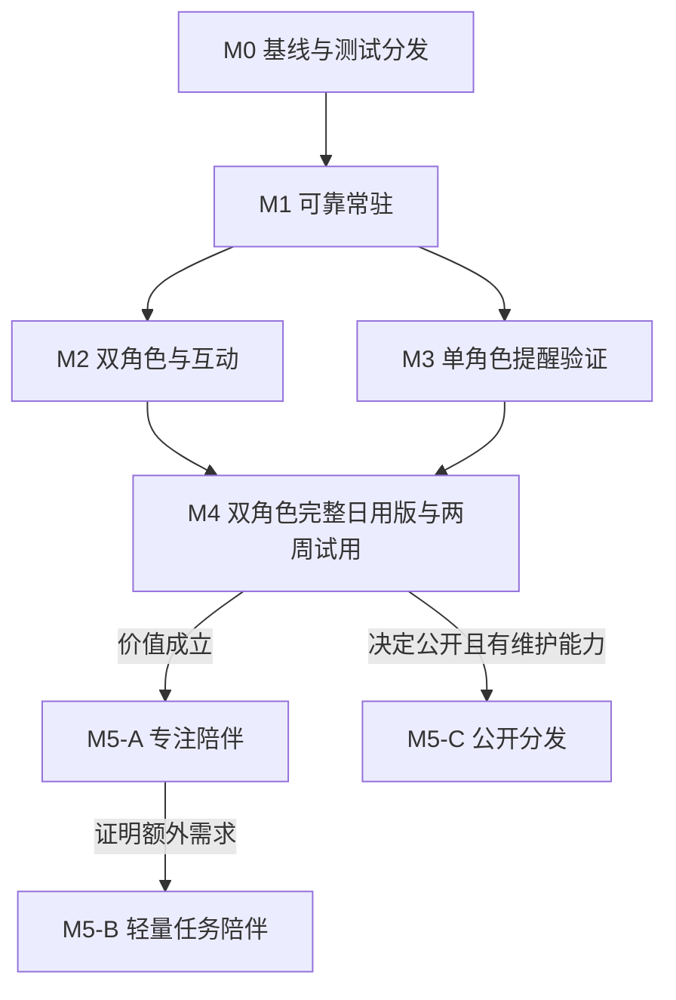

# 长期路线与阶段入口

更新：2026-09-23。产品范围和 Goal 契约以 [PRODUCT-PLAN.md](PRODUCT-PLAN.md) 为准；本页只负责依赖导航，[TODO.md](TODO.md) 记录实际状态。

## 当前起点

- 当前隔离集成候选以 `main@cbf5753`（已合并 PR #12）为基线，先合入 G7 开发栈，再在本地推进 M5-A/B/C 可独立完成的技术部分；源码基线与验收缺口见 [M5 技术候选](M5-TECHNICAL-CANDIDATE.md)。稳定版本仍为 v0.2.0。最终提交的两平台原生包及实机验收尚未完成。
- 重构提交的 Windows/macOS CI 已通过，见 [验证记录](ARCHITECTURE-VALIDATION.md)。
- 待机、注视和拖动已实现；本次架构的双平台 GUI 回归尚未完成，M0 未关闭。
- 旧版 macOS 状态栏“切换到当前桌面”随 PR #12 进入主线。本候选将它接入新架构唯一托盘和桌面控制器，并已实现双平台托盘、穿透、位置持久化、双角色互动、日常提醒及本地备份导入导出；自动检查与本候选实机验收分别记录，不以旧版结果替代。

## 依赖路径

| 阶段 | 对应候选 Goal | 必须守住的出口 |
|---|---|---|
| M0 | G0 | 同提交测试构建、自动检查、双平台回归及性能基准；缺口如实保留 |
| M1 | G1、G2 | 无需终端控制与退出；穿透可恢复；重启和显示器变化后可找回窗口 |
| M2 | G3、G4 | 所有者确认素材；两个真实角色通过同一清单，切换不改变业务状态 |
| M3 | G5、G6 | Rust 提醒状态与存储；独立可交互气泡；获得真实反馈 |
| M4 | G7 | 两角色与提醒完整合流；两周试用满足价值和稳定底线 |
| M5-A | G8 | 单会话专注体验有效，不增加通知打扰 |
| M5-B | G9 | 当前一个任务的反馈有额外价值，不扩成任务管理器 |
| M5-C | G10 | 公开意愿、预算、素材范围、签名与维护责任明确；安装升级可回退 |

G3 的候选确认、样例和资源准备可独立安排；M2 的应用接入与验收仍需 M1。M3 不依赖第二角色完成，但单角色原型不能冒充正式首个日用版本。

## 节奏与质量

6—12 个月是观察与复盘范围，不是全部功能必须完成的期限。业余迭代按里程碑集中实测：所有者负责 Windows，协作者负责 Mac。独立工作可推进，未完成双平台验收的阶段不能关闭。

测试构建前移到 M0。必要设置、性能检查、版本化存储和回退随依赖它们的功能交付。公开分发不要求先完成专注或任务陪伴；自动更新则必须等待手工升级与回退可靠之后。

每个 Goal 启动前固定基线、范围与验收；不在一个目标中执行全年路线。新增诉求先与产品方向对照。连续两轮针对性调整仍无价值时，暂停该方向并共同复盘，不通过加功能回避问题。

## 当前下一入口

当前入口是**最终技术候选的同提交构建与集中实机回归**。旧 M0 双平台测试产物曾交付并静态校验，见 [M0 构建记录](M0-BUILD-REPORT.md)，但不能代替新架构加 M5 功能后的回归。所有者负责 Windows、协作者负责 Mac；未完成两平台观察、两周试用与价值复盘前，M0/M1/M4/M5 均不能因源码或自动检查通过而关闭。
